# Benchmark

Originally, the experiments were conducted on a workstation equipped with an NVIDIA RTX 3090 GPU and an Intel Xeon E5-2630 v4 CPU, with and without GPU acceleration. To reproduce our results, see the experiments code. If executed in the same architecture mentioned, it is expected to obtain the results shown below.

## Real Datasets

### MovieLens Datasets: Execution Time (min) and GOBRec CPU/GPU Speedups over mab2rec and iRec

  <table>
    <thead>
      <tr>
        <th></th>
        <th></th>
        <th colspan="3">LinGreedy</th>
        <th colspan="3">LinUCB</th>
        <th colspan="3">LinTS</th>
      </tr>
      <tr>
        <th></th>
        <th></th>
        <th></th><th>Mab2Rec</th><th>iRec</th>
        <th></th><th>Mab2Rec</th><th>iRec</th>
        <th></th><th>Mab2Rec</th><th>iRec</th>
      </tr>
    </thead>
    <tbody>
      <tr>
        <td rowspan="13">
          GOBRec
        </td>
        <td colspan="10" align="center">
          MovieLens-100k
        </td>
      </tr>
      <tr>
        <td></td>
        <td>Time</td><td>0.8</td><td>0.5</td>
        <td>Time</td><td>1.1</td><td>0.9</td>
        <td>Time</td><td>1.9</td><td>464.9</td>
      </tr>
      <tr>
        <td>CPU</td>
        <td>0.01</td><td>106.7×</td><td>66.7×</td>
        <td>0.07</td><td>15.6×</td><td>13.5×</td>
        <td>0.07</td><td>29.0×</td><td>7115.4×</td>
      </tr>
      <tr>
        <td>GPU</td>
        <td>0.00</td><td>192.1×</td><td>120.6×</td>
        <td>0.01</td><td>102.5×</td><td>88.5×</td>
        <td>0.00</td><td>379.1×</td><td>93059.7×</td>
      </tr>
      <tr>
        <td colspan="10" align="center">
          MovieLens-1M
        </td>
      </tr>
      <tr>
        <td></td>
        <td>Time</td><td>18.0</td><td>15.7</td>
        <td>Time</td><td>23.9</td><td>19.2</td>
        <td>Time</td><td>41.4</td><td>---</td>
      </tr>
      <tr>
        <td>CPU</td>
        <td>0.11</td><td>168.6×</td><td>147.1×</td>
        <td>1.32</td><td>18.0×</td><td>14.5×</td>
        <td>1.26</td><td>32.8×</td><td>---</td>
      </tr>
      <tr>
        <td>GPU</td>
        <td>0.06</td><td>322.4×</td><td>281.2×</td>
        <td>0.20</td><td>117.4×</td><td>94.3×</td>
        <td>0.07</td><td>576.6×</td><td>---</td>
      </tr>
      <tr>
        <td colspan="10" align="center">
          MovieLens-10M
        </td>
      </tr>
      <tr>
        <td></td>
        <td>Time</td><td>406.5</td><td>332.6</td>
        <td>Time</td><td>526.1</td><td>441.4</td>
        <td>Time</td><td>941.3</td><td>---</td>
      </tr>
      <tr>
        <td>CPU</td>
        <td>2.05</td><td>198.1×</td><td>162.1×</td>
        <td>28.21</td><td>18.7×</td><td>15.7×</td>
        <td>27.70</td><td>34.0×</td><td>---</td>
      </tr>
      <tr>
        <td>GPU</td>
        <td>0.85</td><td>476.3×</td><td>389.7×</td>
        <td>4.13</td><td>127.4×</td><td>106.9×</td>
        <td>1.21</td><td>778.9×</td><td>---</td>
      </tr>
    </tbody>
  </table>

## Simulated (toys) datasets

### LinGreedy - Toy Dataset (500k Interactions): Elapsed Time (s) vs. Number of Items

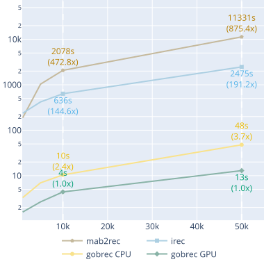

### LinGreedy - Toy Dataset (500k Interactions): Predicted Elapsed Time (s) vs. Predicted Number of Items

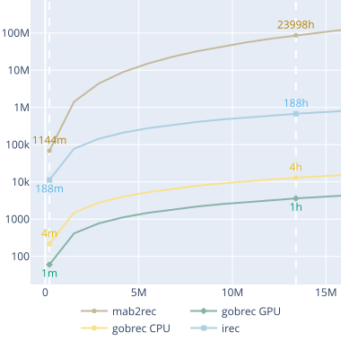

### LinGreedy - Toy Dataset (1k Items): Elapsed Time (s) vs. Number of Interactions

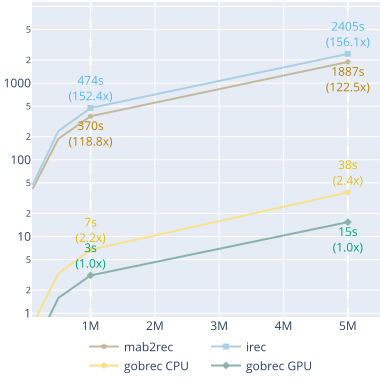

### LinGreedy - Toy Dataset (1k Items): Predicted Elapsed Time (s) vs. Predicted Number of Interactions

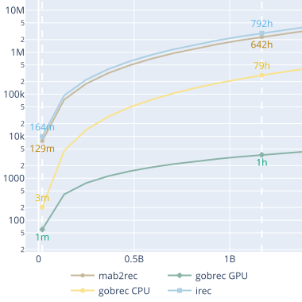

### LinUCB - Toy Dataset (500k Interactions): Elapsed Time (s) vs. Number of Items

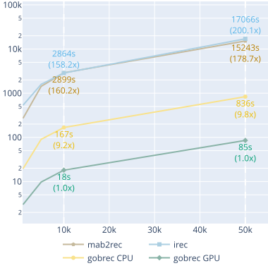

### LinUCB - Toy Dataset (500k Interactions): Predicted Elapsed Time (s) vs. Predicted Number of Items

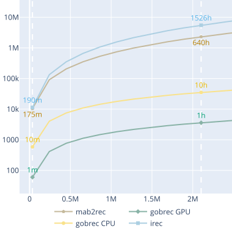

### LinUCB - Toy Dataset (1k Items): Elapsed Time (s) vs. Number of Interactions

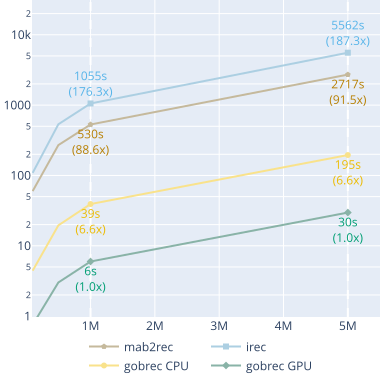

### LinUCB - Toy Dataset (1k Items): Predicted Elapsed Time (s) vs. Predicted Number of Interactions

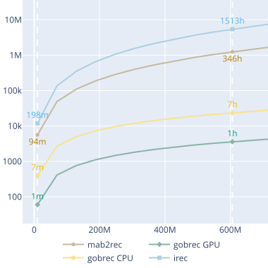

### LinTS - Toy Dataset (500k Interactions): Elapsed Time (s) vs. Number of Items

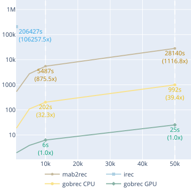

### LinTS - Toy Dataset (500k Interactions): Predicted Elapsed Time (s) vs. Predicted Number of Items

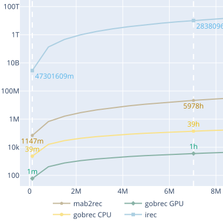

### LinTS - Toy Dataset (1k Items): Elapsed Time (s) vs. Number of Interactions

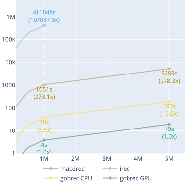

### LinTS - Toy Dataset (1k Items): Predicted Elapsed Time (s) vs. Predicted Number of Interactions

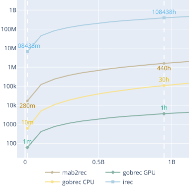

### Memory usage comparison

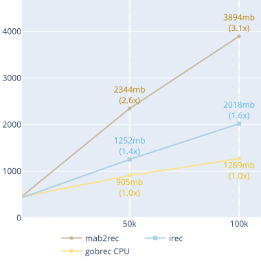