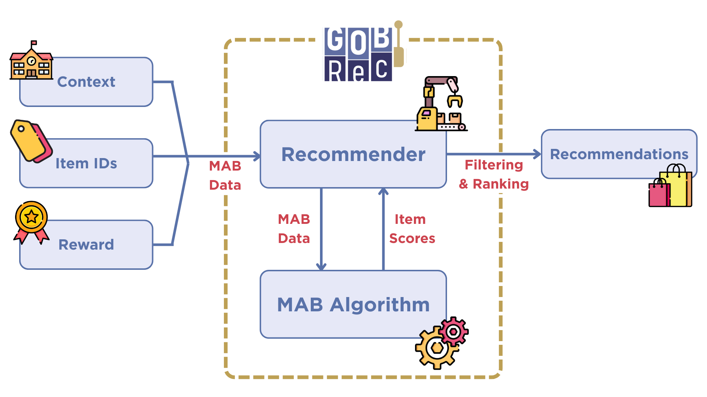

.. image:: _static/GOBRecLogo.svg
   :align: center
   :width: 50%

GOBRec: GPU Optimized Bandits Recommender
=========================================

GOBRec is a Python library with an optimized implementation of contextual multi-armed bandits (CMABs) for recommender systems. The library has a simple API that allows you to use the CMAB algorithms to generate item (arms) expectations, using it for tasks other than recommendations. You can also use any of the implemented CMABs inside the Recommender to efficiently generate top-K recommendations.

The main contribution of GOBRec is its efficient implementation. With the vectorized code, using only CPU, our implementation was up to **150** times faster than other libraries. Using GPU optimization, our library achieved a speed gain of **700** times. More details about these comparisons can be found in the `benchmark page <benchmark.html>`_.

The GOBRec source code is available at: `https://github.com/UFSCar-LaSID/gobrec <https://github.com/UFSCar-LaSID/gobrec>`_

Library design
==============

The library leverages vectorized operations and optional GPU acceleration to enable efficient training and inference in large-scale settings. The library is structured around two core components: *(i)* the **MAB algorithm** and *(ii)* the **Recommender**, explained further in detail. Together, these components support incremental learning and the generation of top-K recommendations in an online setting.

* **MAB Algorithm:** This module is responsible for incremental model updates and executing exploration strategies. It provides optimized implementations of widely used linear CMAB methods, including **LinUCB** [1], **LinTS** [2], and **LinGreedy** [3]. All supported linear algorithms share a common ridge regression formulation for parameter estimation, which is encapsulated in a reusable base implementation to promote extensibility. In addition, GOBRec provides a **MABAlgo** interface that specifies the required methods and parameters for implementing new bandit algorithms that can be integrated into the recommendation pipeline.

* **Recommender:** It is responsible for efficiently ranking the item scores produced by an MAB algorithm and generating a top-K list of recommended items. It also handles the exclusion of previously consumed items from the recommendation set, ensuring that only eligible items are considered. The recommender operates independently of the underlying bandit implementation and can therefore be used with any algorithm conforming to the **MABAlgo** interface, facilitating the integration of new methods within the GOBRec framework.

The usage pipeline consists of feeding the recommender with context vectors, observed decisions (i.e., consumed item identifiers), and rewards (i.e., ratings or implicit feedback). These interactions are then used to update the underlying CMAB model incrementally. At inference time, new contexts are passed to the recommender, which invokes the MAB algorithm to score candidate items, filters previously consumed items, and returns a top-K recommendation list.

Documentation pages
===================

.. toctree::
   :maxdepth: 1
   :titlesonly:

   installation
   quick start
   benchmark
   contributing
   public API